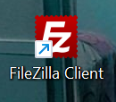

<strong>Repository ini dibuat untuk memenuhi tugas Pemrograman Web</strong>
| <strong>Nama</strong> | <strong>Riris Naomi Gurning</strong> |
| ----------- | ----------- |
| <strong>NIM</strong> | <strong>312010190</strong> |
| <strong>Kelas</strong> | <strong>TI.20.A.1</strong> |

# UAS Antrian Loket (Genap)

## Link

- [Dokumentasi Sistem](https://youtu.be/egYWeSfUdxc)
- [Demo Aplikasi;](http://sistemantrianriris.epizy.com/)

<p>Untuk melakukan Program ini harus instalasi Codeigniter 4 dapat dilakukan dengan dua cara, yaitu cara
manual dan menggunakan <b>composer</b>. Pada praktikum ini kita menggunakan cara composer.
</p> Setelah itu buka <b>XAMPP</b></p>


<p>klik shell, kemudian ketik: </p>

```php
cd C:\xampp\htdocs\UAS
```

<p>Setelah itu ketik:</p>

```
php spark serve
```

</p>

<p>Kemudian ketik:</p>

```
http://localhost:8080
```

<p> Saya membuat webhosting dari ( https://app.infinityfree.net/ )</p>

<p> Untuk Upload data ke webhosting saya menggunakan filezilla Client</p>


